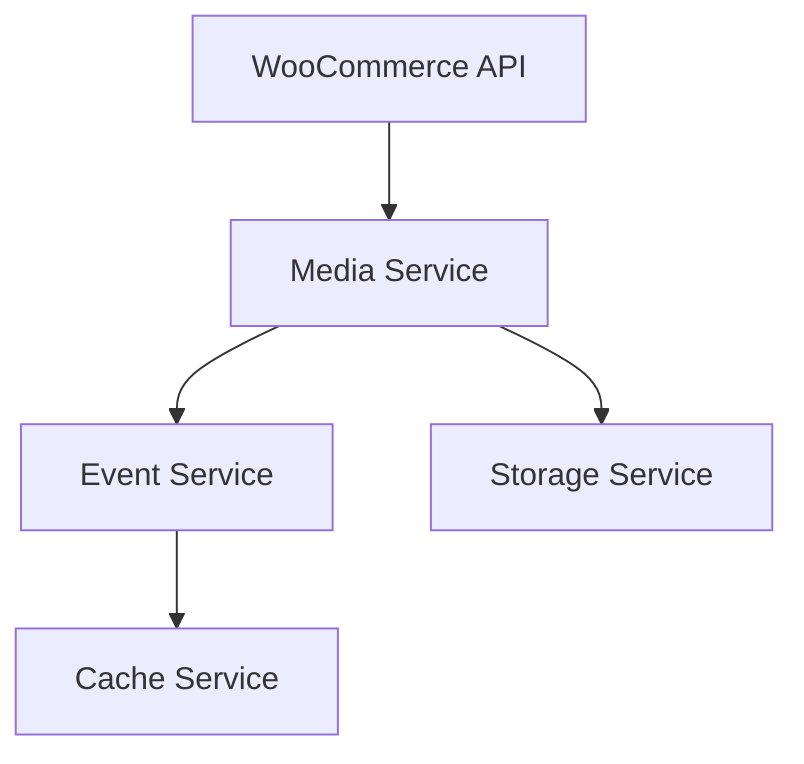

# Sistem Mimarisi

## Genel Bakış

Sistem, aşağıdaki ana bileşenlerden oluşur:

### Frontend
- Single Page Application (SPA)
- Bootstrap 5 + Custom CSS
- Modüler JavaScript yapısı
- WebSocket gerçek zamanlı güncellemeler

### Backend
- FastAPI web framework
- PostgreSQL veritabanı
- Redis cache ve kuyruk sistemi
- Celery asenkron görevler

## Katmanlar

### 1. Presentation Layer
- Web UI (HTML, CSS, JavaScript)
- REST API endpoints
- WebSocket handlers

### 2. Business Layer
- Service classes
- Business logic
- Validation
- Authorization

### 3. Data Layer
- Database models
- Repositories
- Cache mechanisms
- External API clients

## Servisler

### Core Services
- AuthService
- UserService
- ProductService
- OrderService
- CategoryService
- MediaService
- SyncService

### Integration Services
- WooCommerceService
- WolvoxService
- EmailService
- NotificationService
- CacheService

### Support Services
- LoggingService
- MonitoringService
- BackupService

## Veritabanı Şeması

Ana tablolar ve ilişkileri için [database.md](database.md) dosyasına bakın.

## Cache Stratejisi

1. Uygulama Cache
- Redis
- Key patterns
- TTL politikaları

2. HTTP Cache
- ETags
- Conditional requests
- Cache-Control headers

## Asenkron İşlemler

1. Kuyruk Sistemi
- Celery workers
- Redis broker
- Task prioritization

2. WebSocket
- Gerçek zamanlı güncellemeler
- Bağlantı yönetimi
- Heartbeat mekanizması

## Güvenlik

Detaylı güvenlik bilgileri için [security.md](security.md) dosyasına bakın.

## Monitoring

1. Sistem Metrikleri
- CPU/Memory kullanımı
- Disk I/O
- Network traffic

2. Uygulama Metrikleri
- Request/Response times
- Error rates
- Cache hit rates
- Sync success rates

3. İş Metrikleri
- Daily active users
- Sync volumes
- Order volumes

## Deployment

Deployment mimarisi için [deployment.md](deployment.md) dosyasına bakın.



## Servis Detayları

### 1. Media Service
- Görsel işleme ve optimizasyon
- WooCommerce API entegrasyonu
- Rate limiting ve retry mekanizması

### 2. Event Service
- Asenkron event yönetimi
- Pub/sub pattern
- Event logging

### 3. Cache Service
- Redis entegrasyonu
- Cache invalidation
- TTL yönetimi

### 4. Storage Service
- Dosya sistemi operasyonları
- S3 entegrasyonu
- Temporary storage yönetimi

## Teknoloji Stack

- Python 3.12+
- FastAPI
- aiohttp
- Redis
- PostgreSQL
- Docker

## Güvenlik

1. Authentication
   - Basic Auth
   - API Key
   - JWT

2. Rate Limiting
   - IP based
   - User based
   - Endpoint based

3. Data Protection
   - Encryption at rest
   - Secure file handling
   - Input validation

## 🔄 Genel Mimari

```
src/
├── api/            # API endpoint'leri
├── core/           # Çekirdek modüller
├── models/         # Veri modelleri
├── repositories/   # Veri erişim katmanı
├── services/       # İş mantığı
└── utils/          # Yardımcı fonksiyonlar
```

## 🔄 Veri Akışı

1. HTTP İsteği → FastAPI Router
2. Router → Service Layer
3. Service → Repository
4. Repository → Database/API
5. Response ← Service ← Repository

## 🏢 Katmanlar

### API Layer (api/)
- HTTP endpoint'leri
- Request/response şemaları
- Validation
- Rate limiting
- Authentication

### Service Layer (services/)
- İş mantığı
- Senkronizasyon
- Veri dönüşümleri
- Cache yönetimi

### Repository Layer (repositories/)
- Veri erişimi
- CRUD operasyonları
- Query optimizasyonu

### Core Layer (core/)
- Konfigürasyon
- Logging
- Database bağlantıları
- Middleware'ler

## 🔐 Güvenlik

- JWT tabanlı kimlik doğrulama
- Rate limiting
- CORS politikaları
- Input validation
- Error handling

## 🚀 Performans

- Connection pooling
- Redis önbellekleme
- Async/await
- Bulk operasyonlar
- Query optimizasyonu

## 📊 İzleme

- JSON formatında loglar
- Prometheus metrikleri
- Health check endpoint'leri
- Error tracking 

## State Yönetimi

Uygulama state'i `app_state` dictionary'sinde merkezi olarak yönetilir:

- WooCommerce servisi: `app_state['woo_service']`
- Media servisi: `app_state['media_service']`

Servisler uygulama başlangıcında (`startup_event`) başlatılır ve kapanışta (`shutdown_event`) temizlenir. 